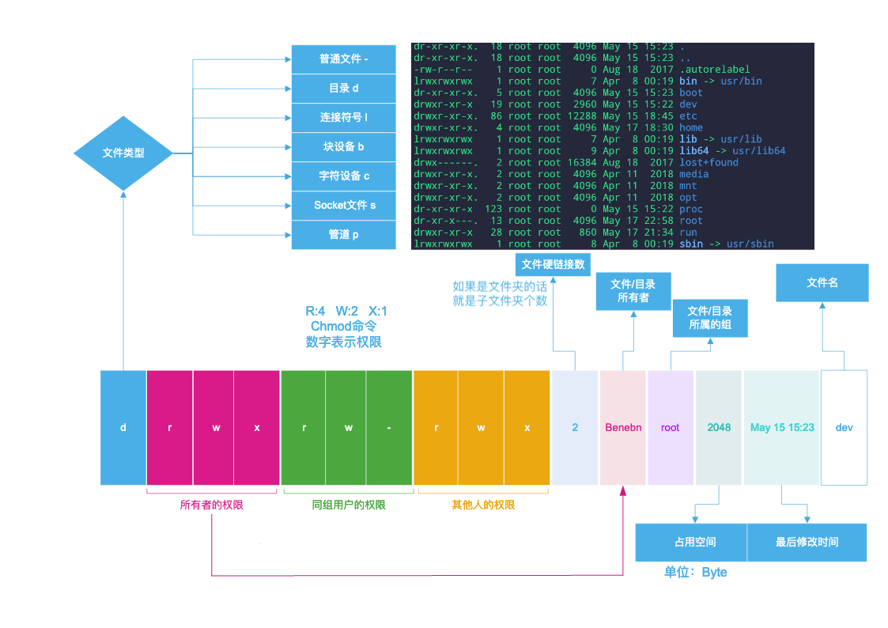

## 命令行历史
unix最开始的Bourne shell 多用户拉垮->linux造Bourne Again shell=BASH->Debian觉得太重就改了改有了dash。  
其他的还有一些魔改版  

>sh 遵循POSIX规范：“当某行代码出错时，不继续往下解释”。bash 就算出错，也会继续向下执行。sh是bash的一种特殊的模式，sh就是开启了POSIX标准的bash， /bin/sh 相当于 /bin/bash --posix，在Linux系统上/bin/sh往往是指向/bin/bash的符号链接  

>POSIX表示可移植操作系统接口（Portable Operating System Interface of UNIX，缩写为 POSIX ）。POSIX标准意在期望获得源代码级别的软件可移植性。换句话说，为一个POSIX兼容的操作系统编写的程序，应该可以在任何其它的POSIX操作系统上编译执行。  

## 基础命令
内嵌命令，直接写在bash源码里面的，对应的就是外部命令  
man 查看命令用法，内嵌命令用man -f xx列出可用的手册，就可以man 1p cd查看对应手册的解释   
help 可以查看内置命令的参数用法，外置命令用ls --help  
--version可以查看命令版本  
type xx 查看是不是内嵌  
ls -al | grep “xx”  -h 人类能读懂的方式展示大小  
**ctrl+l**=clear清屏，reset=test相当于重设一次bash  
history查看命令输入过的历史，+数字可以查看最后几条，-c 清空，前面的数组是编号 !+编号 可以重复打出指定命令。**他不是读取.bash_history**  
[bash-oneliner](https://github.com/onceupon/Bash-Oneliner)可以复习
## 文件管理类
cd -回到上次的目录  
ll is an alias for ls -lh  
pwd 当前目录，-P 无视链接
rmdir -p 是递归删除文件夹，若底层目录删除完后父目录为空则递归删除父目录  
/cp使用cp的原生命令，会强制覆盖不提示。alias查看是别名的命令。  

- cat -n 显示行号
- more 翻页完就会自动退出空格下翻b往回翻enter下一行
- less 按需加载，=显示更多信息
- head/tail -n 数字 默认输出头尾10/数字行
- tail -f 可以实时追踪文件变化，ctrl+s/q可以暂停/继续
    - 如果被覆写会出截断错误
    - vim的修改是无法显示的，每一个文件都有 索引节点号index，底层存储方式是inode，vim会保存修改文件的index，ls -i可以查看

echo -e "string" 字符串支持转义  
  
输出重定向
- \> 覆盖重定向写
- \>\>追加重定向写

软链接实际上是独立的文件有独立的文件符号和inode但是data指向了source，所以链接数指的是硬连接
在进入文件夹的软链接 系统不会自动回到source -P才可以  
::: danger ⚡️Danger
**软链接的删除** 软链接删除不会影响原文件，但是删除软链接下的所有文件，**rm -rf softlink/** 会删除原文件夹下的所有文件。
:::
原文件删除软链接就进不去了  

如果不加s `ln source destnation`创建硬链接指向同一个inode，a,b->inode->disk data，删除硬连接符a或b不会影响原文件，最后一个链接被删除时，inode和data都会删除  

## 获取时间
时间的格式只有一种是最好的即[ISO 8601](https://www.iso.org/iso-8601-date-and-time-format.html)规范日期时间的写法  
YYYY-MM-DD hh:mm:ss  
暂时少整理，时间和时间戳是个好知识点  
  
date **+** 解析串，串如果有空格的话用双引号  
"+%Y-%m-%d %H:%M:%S"  
小写y是后两位年份，小写是timestamp  
date -d "1 days ago",年月日时分秒都可以，正的是以前负的是以后的时间  
date -s 设置系统时间。  
ntpdate 命令已经被timedatectl替代了  
cal -n -m 2003-5-1 获得离2003-5-1最近仨月的星期一在最前的日历  

## 用户管理
### 添加删除
useradd -d /home/d1 d2 创建d2但是home文件夹是d1。不能用已有的文件夹  
 
id d2 获得用户的系统id，id是依次累加的，在/etc/passwd文件内存放所有用户，一大堆系统用户是默认创建的服务使用的，顺着uid找就可以看创建的用户  

**su切换用户时会进程套娃**，注意！  
删除用户不会删除home，加-r 就会
### 用户权限
/etc/sudoers文件管权限  
/etc/group文件管用户组  

groupadd/del 增加删除  
**usermod -g group user 把user变更为group，-G是追加**   

文件文件类型  
后四种是伪文件不占空间  
 
 

**chmod {ugoa}{+-=}{rwx} file**  
**chmod 777 file** (7=r1w1x1 二进制的7)  
-R 递归  

如果创建者已经销号了，文件可以被root更改所属user和group  
**chown user file**  
**chgrp group file**  

## 磁盘管理
### 查找压缩
[详解find参数](https://www.cnblogs.com/jiftle/p/9707518.html)  
find path -name/-user/-size(b,c,w,k,M,G)  

查找 path 下 文件名/所属用户/大小(block 512Byte,char 1Byte,word 位长,MB,GB)  

类型 -type **f** 普通文件 **l** 符号连接 **d** 目录 **c** 字符设备 **b** 块设备 **s** 套接字 **p** Fifo  

locate 命令  
每天定时更新，系统所有文件的索引，使用前最好updatedb  
locate xx 会直接返回所有含有xx的文件和目录  

whereis 是返回所有找得到的文件，where找到的是立即执行的  

grep -n 可以显示行号，管道就可以把一个输出传输到另一个输出  

wc 行数为、单词数、字节数  

gzip gunzip 只能压缩文件，不保留压缩文件  
zip 和unzip  dest source -r可以压缩目录，-d可以指定解压存放，不删除文件  
tar -c 产生打包文件 -v 显示详细信息 -f 指定文件名，-z 同时打包压缩 -x 解压tar -C 指定解压路径  
无脑版压缩解压
- tar -cvzf file1 file2 
- tar -xvzf file -C path
### 存储相关
du 目录文件 disk usage 查看占用空间  
-h 人性化 -a 输出包括子目录的文件，-s 只显示总和 -c 显示总和 --d n 最大输出n层子目录  

df 查看空间使用量 disk free  
tmpfs是swap和内存文件系统，也会展示  
devtmpfs是内核启动的时候挂载点  

free -hs 2 隔两秒看次内存  
lsblk 列出块设备 -f 带文件系统类型和**UUID**  
硬盘的类型去看鸟哥的书  

挂载，先用lsblk查看块设备，找到dev里对应的名字一样的设备文件，最后mount,硬盘不支持热插拔
mount dev point  
umount point or dev  
在/etc/fstab文件中配置自动挂载  
UUID=设备的UUID或dev者设备名 /boot挂载点   xfs文件系统     defaults        0 kdump给系统备份的选项 0文件系统检查优先级，系统默认使用fsck来检查系统文件，0不检查1最高  

fdisk -l 查看分区情况,fdisk /dev/sdb 对设备进行分区操作  

mkfs -t 文件系统类型 dev  

## 进程管理
进程可分为前台和后台运行进程(守护进程)，后缀类似于systemd-daemon的意思  
process status=ps  
不加参数就是只显示和本控制台和本用户当前的的进程  
::: info 📝Note
**参数风格** 加 - 是unix 风格  
不加是BSD风格  
:::
a列出带有终端所有用户的进程 x列出当前用户所有进程，包括没终端的 u 显示更多信息  
常用的就aux  
ps -ef 还会显示父进程的id  
pstree -p pid -u 所属user 显示进程树，用户变化才会标示  
::: tip 📌Tip
**特殊pid** **Linux** 中有**pid 0**, pid **1** 和pid 2 三个特殊的进程。   
**pid 0**，即“swapper” 进程，是pid **1** 和pid 2 的父进程。   
**pid 1**，即“init” 进程，所有用户空间的进程均派生自该进程。   
**pid 2**，即“kthreadd” 进程，是内核空间所有进程的父进程。
:::
ssh权限分离，sudo的时候是有个root的ssh代替操作,pts为打开顺序  

ssh被kill之后，新用户登不上，但是先前建立的链接父进程会变1保持连接  
1-sshd-remotelogin-bash  
killall 支持通配符  
kill -l查看信号，-9是强制  

top -d 刷新间隔 -i 不现实闲置僵尸进程(实时占用着的才显示) -p 监控指定PID  

| %Cpu(s):&nbsp;          | &nbsp;0.0 us,                    | &nbsp; 0.1 sy,&nbsp; | &nbsp;0.0 ni,                                   | &nbsp;99.8 id,    | &nbsp; 0.0 wa,   | &nbsp; 0.1 hi,     | &nbsp; 0.0 si,     | &nbsp; 0.0 st                        |
|:----------------------- |:-------------------------------- |:-------------------- |:----------------------------------------------- |:----------------- |:---------------- |:------------------ |:------------------ |:------------------------------------ |
| cup时间(占用比例 | 默 认更改优先 级的user进程 | system系统进程       | nice 指定友 善值的进程 ，越友善优先级越低 | idel 空闲中的时间 | wait等待IO的占用 | hardware interrupt | software interrupt | stole n被虚拟化 设备偷走的时间 |
| PR                      | NI                               | VIRT                 | RES                                             | SHR               |        time+          |                    |                    |                                      |
| priority优先级          | nice值                           | 虚拟内存占用大小     | real实际内存占用                                | share共享内存大小 |            总共占用的CUP时间，+表示精确      |                    |                    |                                      |

shift +p 按照CUP占用分  
shift +n 按照PID大小  
空格立即刷新  
s 设置刷新时间间隔  
c 显示命令完全模式  
命令 k 9终止  

3、查 看磁盘 IO 读写情况：iotop -o（直接查看输出比较高的磁盘读写程序）
4、查看端口占用情况：netstat -tunlp | grep 端口号
## 网络相关
netstat，详细的网络状态
 - -a 显示 所有websocket
 - -n 强制全用ip
 - -l 列出正在监听的服务状态
 - -p 显示那个进程在调用
### 定时任务
crontab依赖于crond  
crontab -e 编辑cron文件 -l 查看当前用户的定时任务 -r 清除当前用户的定时任务  
任务格式`* * * * * 任务文件位置 参数` **几分 几小时 几号 几月 星期几**执行  
| 特殊符号 | 含义                                                                                                            |
| -------- | --------------------------------------------------------------------------------------------------------------- |
| \*        | 代表任何时间。 比如第一个“\*”就代表一小时中每分钟 都执行一次的意思。                                             |
| ，       | 代表不连续的时间。 比如“0 8,12,16 \* \* \* 命令”， 就代表 在每天的 8 点 0 分，12 点 0 分，16 点 0 分都执行一次命令 |
| -        | 代表连续的时间范围。比如“0 5 \* \* 1-6 命令”，代表在 周一到周六的凌晨 5 点 0 分执行命令                           |
| \*/n      | 代表每隔多久执行一次。比如“ \* /10 \* \* \* \* 命令”，代 表每隔 10 分钟就执行一遍命令                                  |

## 包管理
### RPM
RedhatPackageManager  
命名规范: 软件名.版本名.平台.rpm  
rpm -a 所有的 -q[i] 查询 [查看软件信息]，-e 卸载 --nodeps 不考虑依赖直接卸载，安装也有这个参数，可能会导致依赖本软件的软件无法运行  
rpm -ivh  rpm 安装，显示信息和进度条  
::: info 📝Note
rpm不会自动解决依赖，而且还需要完整的rpm才能安  
所以有了yum(Yellow dog Updater, Modified)自动完成解决依赖找源之类的
:::

### yum
**yum** -y **update**：升级所有包同时也升级软件和系统内核  
**yum** -y **upgrade**：只升级所有包，不升级软件和系统内核  
yum search Software 搜索软件  
yum check-update 检查是否有可用的更新 rpm 软件包  
yum remove Software 删除指定的 rpm 软件包  
yum list Software 显示可用的软件包信息  
yum clean (all)清理 yum 过期的缓存  
yum deplist 显示 yum 软件包的所有依赖关系（看不太懂）  

