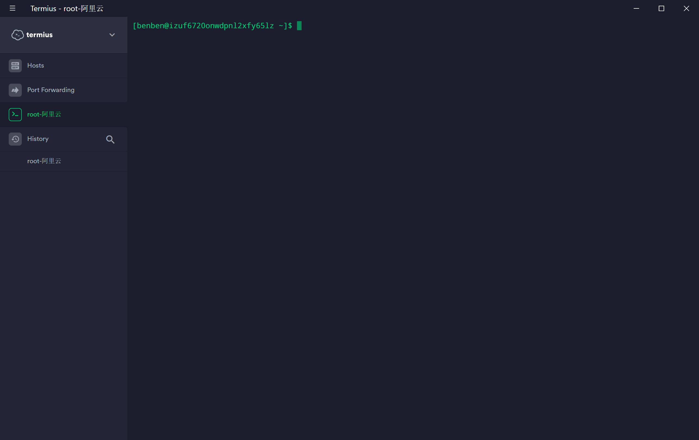
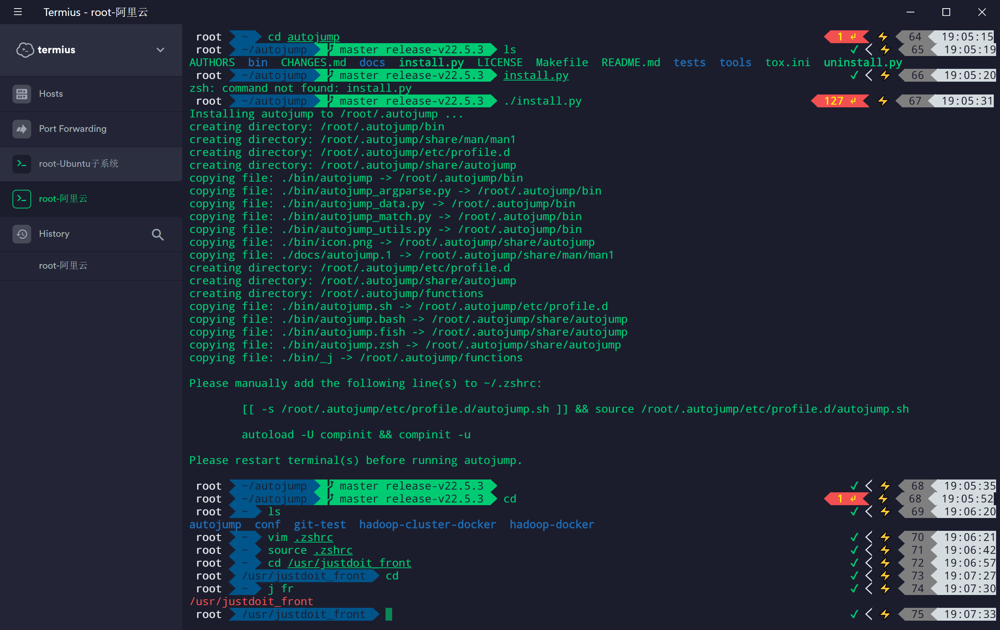

::: warning Warning
title: zsh真香  
linux 配置 oh my zsh和zsh  
到处安利~
:::

<!-- more -->
## 安装
MS商店直接就能安装，简单无脑。  
安装完之后第一次使用会等待一段时间，有长有短根据你机器配置来的。等待足够长时间之后就会让你设置用户名和密码，先填写一个，记住这个不要忘了。  
在你没有动root用户名之前，这个最小子系统的root密码每次开机都会重置一个随机密码，直到你输入命令
```
sudo passwd
```
然后就会让你输入一次当前用户名密码，两次root(UNIX)密码,这样就成功的设置了root密码，别给忘了，很麻烦。
## 配置ssh
设置完用户名和密码之后我们来设置ssh，windows的cmd很难用而且还有不停的提示音耳朵简直爆炸  
设置ssh之后就可以使用外部的Termius，xshell，putty连接啦。  
- **顺手更新下阿里云软件源**  
备份
```
sudo cp /etc/apt/sources.list /etc/apt/sources.list.bak
```
编辑
```
sudo vim /etc/apt/sources.list
```
把所有内容注释掉，把下面这些地址粘贴进去

::: details Click to see more

```
deb http://mirrors.aliyun.com/ubuntu/ bionic main restricted universe multiverse

deb-src http://mirrors.aliyun.com/ubuntu/ bionic main restricted universe multiverse

deb http://mirrors.aliyun.com/ubuntu/ bionic-security main restricted universe multiverse

deb-src http://mirrors.aliyun.com/ubuntu/ bionic-security main restricted universe multiverse

deb http://mirrors.aliyun.com/ubuntu/ bionic-updates main restricted universe multiverse

deb-src http://mirrors.aliyun.com/ubuntu/ bionic-updates main restricted universe multiverse

deb http://mirrors.aliyun.com/ubuntu/ bionic-backports main restricted universe multiverse

deb-src http://mirrors.aliyun.com/ubuntu/ bionic-backports main restricted universe multiverse

deb http://mirrors.aliyun.com/ubuntu/ bionic-proposed main restricted universe multiverse

deb-src http://mirrors.aliyun.com/ubuntu/ bionic-proposed main restricted universe multiverse
```

:::

保存退出，然后更新apt
```
sudo apt-get update
sudo apt-get upgrade
```

- **重装自带的ssh**  
自带的可能不稳定，重新装一下就好了

```
sudo apt-get remove openssh-server
sudo apt-get install openssh-server
```
- **编辑sshd_config文件,允许用户连接** 
```
sudo vim /etc/ssh/sshd_config
```
`Port 23`端口最好不要用22，可能和windows冲突  
`PasswordAuthentication yes`允许用户名密码登录  
`PermitRootLogin yes`允许root登录  
`PubkeyAuthentication no`不校验公钥
- **重启ssh服务**
不能用systemctl,因为init进程pid并不是1
```
sudo service ssh restart
```
- **测试一下**  
cmd输入命令
```
ssh  -o StrictHostKeyChecking=no root@127.0.0.1
```
然后会让你输入密码，能登陆进去就成功了。ssh配置就完了    
在xshell中和termius中设置好就可以用了🎉
- **开机启动**
每次开机都要先启动一下Ubuntu才能进行ssh，作为一个懒人，当然要用脚本了。  
WSL貌似很早就支持后台驻留进程，非常方便，只有一个init和sshd进程占资源也很少  
root编辑
```
sudo vim /etc/init.wsl
```
写入并保存
```
#! /bin/sh
/etc/init.d/cron $1
/etc/init.d/ssh $1
/etc/init.d/supervisor $1
```
安装supervisor赋予脚本执行权限
```
sudo apt-get install supervisor
sudo chmod +x /etc/init.wsl
```
之后我们就可以通过`sudo /etc/init.wsl [start|stop|restart]`停止启动我们的服务，但是还需要root密码  
编辑`sudo vim /etc/sudoers`添加
```
%sudo ALL=NOPASSWD: /etc/init.wsl
```

::: danger ⚡️Danger
一定要在所有东西做完之后在文本最后添加！！！  
不然会失败
:::

linux部分大功告成！  
在windows下新建一个文本文档，写入下面内容，保存为随便一个名字后缀 **.vbs**文件
```
Set ws = CreateObject("Wscript.Shell")
ws.run "ubuntu1804 run sudo /etc/init.wsl start", vbhide
```
扔到开机自启文件夹   
`[C:\Users\你当前的用户\AppData\Roaming\Microsoft\Windows\Start Menu\Programs\Startup]`  
里就会开机自启，
重启开机直接连接试试。
::: tip 📌Tip
可以在windows控制面板->程序->更改或关闭windows设置->适用于windows的最小linux子系统  
控制是否启用系统中的该功能，如果不启用就不会开始init进程也不会耗电。
:::

## OhMyZSH
^dddc45
这是一个好用的shell命令行有很多插件。（确定不是因为好看才装的？  
### 安装ZHS和oh my zsh
ssh连接以后是这样的，但是很丑啊。。。自动补全跳转啥的都不好用。


**ubuntu使用**

```
sudo apt update
sudo apt install zsh
chsh -s /bin/zsh
```
**centos**（也就是阿里云）
```
yum install zsh -y
chsh -s /bin/zsh
```
**然后执行**
```
sh -c "$(wget https://raw.github.com/robbyrussell/oh-my-zsh/master/tools/install.sh -O -)"
```
安完之后`ls ~/.oh-my-zsh/themes`可以查看主题，不过最好看的在下面。  
现在新开一个tab，如果主题没更换，就重启一次，如果还没更换，就是安装失败了

### 安装插件和主题
所有的设置都存放在`~/.zshrc`文件里`ZSH_THEME=""`切换你的主题  

**ubuntu**
```
sudo apt install zsh-theme-powerlevel9k
```
**centos**
```
git clone https://github.com/bhilburn/powerlevel9k.git ~/.oh-my-zsh/custom/themes/powerlevel9k
```
然后切换`ZSH_THEME="powerlevel9k/powerlevel9k"`  

**插件**

```
git clone https://github.com/zsh-users/zsh-syntax-highlighting.git ${ZSH_CUSTOM:-~/.oh-my-zsh/custom}/plugins/zsh-syntax-highlighting
git clone https://github.com/zsh-users/zsh-autosuggestions $ZSH_CUSTOM/plugins/zsh-autosuggestions
```
**ubuntu安装autojump**
```
sudo apt-get install autojump
```
需要把`. /usr/share/autojump/autojump.sh`添加到`~/.zshrc`文件尾。  
**centos安装autojump**
```sh
git clone https://github.com/joelthelion/autojump.git
cd autojump
./install.py
```
需要把`[[ -s ~/.autojump/etc/profile.d/autojump.sh ]] && . ~/.autojump/etc/profile.d/autojump.sh`添加到`~/.zshrc`文件尾，他会有提示。  
一定要添加到文件尾，不要在中间！之后就可以用 ***j*** 直接跳转了  
**编辑文件`~/.zshrc`**
- 添加 export DEFAULT_USER="whoami"
- 添加 export TERM="xterm-256color"
- 修改插件(放心修改不会变卡😂

```
plugins=(git extract ruby gem rails rvm python pip npm node scala docker ant gradle golang redis-cli colored-man-pages zsh-syntax-highlighting zsh-autosuggestions)
```  

- 修改 ZSH_THEME="powerlevel9k/powerlevel9k"
- 最后一行添加 POWERLEVEL9K_CONTEXT_TEMPLATE="%n"
    - 这个是用来去掉阿里云前面又臭又长的主机名的，留下了用户名。其他的不用动就很帅  


重启或者新开选项卡或`source ~/.zshrc`就有作用了。  
安完之后敲shell就舒服多了

## 注意事项

**文件读写**  
  
windows下的磁盘文件都挂载到了/mnt，盘符对应win的盘符，不过外置驱动器是不会自动挂载的  

**Docker**   
  
docker本身是深入系统服务的软件，开启docker必须要访问windows上面的docker进程。  
但是既然这样为什么不直接使用windows上的docker呢？还不会有性能损耗。  
Docker无法在win10家庭版运行，使用toolbox可以试试.不过对于surface的性能来说，可以，但没必要。  
  
**服务管理**   
  

::: danger ⚡️Danger
不能使用systemctl,因为init进程pid并不是1。这个本质上是windows开起了一个进程通过MINGW64运行linux命令，所以系统的最高进程和普通的linux不一样，无法调用systemctl。  
建议使用service
:::

**密钥**   
  
密钥和Windows中的密钥匙不互通的，ssh-keygen会生成一个新的存储在WSL的~/.ssh里面。  
软件使用密钥的时候(git)要注意。  
## 参考
[ssh登录免验证](https://unix.stackexchange.com/questions/229124/how-do-i-run-the-ssh-command-to-set-stricthostkeychecking-no)  
[WSL开机启动ssh](https://zhuanlan.zhihu.com/p/47733615)  
[Ubuntu修改阿里源](https://blog.csdn.net/zhangjiahao14/article/details/80554616)  
[WSL配置ssh](https://blog.csdn.net/raoweijian/article/details/65661302)  

