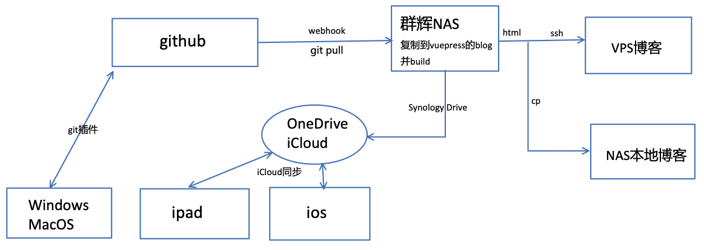

## 库的目的 
这个库是用来写技术笔记打造个人知识库的，为避免忘记以及其他人下载之后能够看懂，特此记录  
库会的blog会被vuepress渲染，所以在满足需求的情况下尽量使用兼容的Markdown+插件的语法
## 库所使用的插件
### 插件
- **Obsidian git**用来同步github和多平台
    - 注意不要同步.obsidian文件夹，在gitignore里面配置一下就可了，有很多文件实时变更每次都冲突
- **show whitespace** 显示空格 选项全打开
- **show current file path** 右下角显示文件路径点击可复制
- **Advanced Tables** 表格辅助插件
    - Excel to Markdown Table 可以直接从excel粘贴
    - obsidian-table-editor 还未发布从github上找的
- **Auto pair chinese symbol** 中文符号自动成对
- **Remember cursor position** 切换文件时记住鼠标位置
- **Search on Internet** 搜索
- **Mind Map** 思维导图
    - **enhancing-mindmap** 可以编辑的思维导图，兼容md语法
        -  mindmap-plugin: basic 在formatter里面加入这一个启用
    - **markmind** ~~批注pdf，不能手写，其他的都可以，可以类似于marginnote3那种。~~
    -  直接配合OneNote使用思维导图，不需要批注了，可开启大纲表格视图
- **Editor Syntax Highlight** 代码高亮 
- **Natural Language Dates** 按@输出日期
    - YYYY-MM-DD dddd 表示 年-月-日 星期
- **calendar** 日历
    - 配合日记
    - obsidian-periodic-notes 自动日报周报分类，看插件github官网怎么配置的路径
    - `MM[月]/[第]WW[周]/YY-MM-DD[日报]`,`MM[月]/[第]WW[周]/[周报]YYYY-WW`
- **Admonition** 功能提示块 ^5925eb
    - 语法在vuepress上可能会渲染为白色代码块可以接受
    - 类型有ad-(type)
        - `note`,`abstract`,`info`,`tip`,`success`,`question`,`warning`,`failure`,`danger`,`bug`,`example`,`quote`
        - [样式参考](https://squidfunk.github.io/mkdocs-material/reference/admonitions/#inline-blocks)
    - 主要用的参数写在内容第一行,`collapse:open/none`,`title:xxx`，一般只用这俩就行
- **dynamic table of contents** 生成大纲，暂时用不着
    - 默认是toc代码块渲染，用脚本直接更改为双括号[\[toc]\] 就可以在vuepress中渲染
    - 有BUG不能用行数错误，有些行无法复制,作者自己不修复，寄了，插件是个好插件
- **Sliding panes** 多栏侧边划的
- **Note Refactor** 大文档拆分wiki链接
- **Auto Link Title** 粘贴链接的时候自动抓取网页的标题，填充为文字
    - 关闭自动替换链接
- **Paste URL into Selection** 链接粘贴自动标题
    - 剪贴板链接「[https://example.com](https://example.com/)」选中一段文字「TEXT」粘贴，这个链接就会和文字结合在一起成为  
    `[TEXT](https://example.com)`
- **Obsidian-Charts** 命令行输入chart 从表创建和自己创建图
    - 在vuepress里面会简单渲染为一个不认识的代码块
- 脚注
    - **Obsidian Tidy Footnotes** 生成脚注[^1]，我设置快捷键为`ctrl+6`直接在光标处插入脚注[^2]
        - 修改main.js,在footnoteDetail字符串添加`\n`,脚注后带俩空格，但是用的时候需要向前两下粘贴
    - **Tidy Footnotes** 脚注整理，命令行输入tidy，不过好像没怎么用到
-  **Consistent attachments and links** 转换插件
    - 使用双链接时需要回来重新嵌入一下为文件格式以便兼容
    - 设置快捷键为`ctrl+l` 把双链全转为标准md，双链都转换,但是只会在本目录下配合下面使用
    - 设置快捷键为`ctrl+p` 把文件链接都转换为相对链接，双链转换完后用这个重新确定路径，多个重名时会是遍历目录的第一个
    - 直接使用转换插件把所有选项全关了，留下move attachments with note和update links
- **Attachment Name Formatting** 自动重命名附件
    - 移动文档的时候提前关掉
    - 默认粘贴附件和图片空格会被替换成%，vuepress无法渲染
    - 进入JS`main.js` 把`join(" ")`替换为`join("-")` 这样就可以随便渲染了
    - ~~还是没解决图片路径前面加一个`./` 的问题~~ 脚本解决了
- **dataview** 最核心的插件之一，但我不会//TODO
- **Tag Wrangler** 标签管理，tag可以批量重命名，但是tag必须**不能含有符号**，可以有emoji
- **Various Complements** 一些自动补全 打开当前文件夹和dict，IME选项，关掉space after
- **Media Extended** 多媒体嵌入插件
    - **Media Extended BiliBili Plugin** 支持bilibili
    - 插入链接即可，在预览模式中点击链接就会有一个单独的播放器播放，再切回编辑模式就可以一边看一边写
    - 设置快捷键`command+t`通过播放器获得时间戳，可以生成一个带时间戳的链接，点击就可以跳转，渲染之后也可以点开。
- **Remotely save** 保存，onedrive授权，多端同步，手动去同步配置文件夹

### CSS 
下面有附代码，建立一个css文件他自己会读取
1. 主题使用的是Obsidian Nord
2. 圆点调整，不同层级用不同的样式没有实现，但是修改之后可接受
3. 添加链接的小文件图标
4. 大纲连接线和文件层级连接线
5. 背景图片太复杂而且还要多一个文件直接放弃，可自定义透明度
6. 所使用的自定义[CSS](https://1drv.ms/u/s!Ave4mfYaItDJhMdWWLsPoUdrShE2lw?e=H3snSQ)
## 库的部署与同步

## 库写作时的注意事项
[博客写作的注意事项](blogReadme.md#^255951)^5c3a93
- 写作时双链就只是好看，直接用Markdown标准文件链接渲染的时候还不会出错
- 使用 [功能提示块](#^5925eb)的时候如果要包含代码，外面用四层\`里面用三层点,不要用拓展语法`!!!`和`???` vuepress中不渲染，但是嵌套代码块会渲染，就用这仨功能就行了
- ~~OneNote链接复制出来之后粘贴到md里，使用时直接复制链接在OneNote里面粘贴点击就跳到了~~ OneNote准备弃用了，goodnotes替代吧
- 插入时间设置 `YYYY-MM-DD HH:mm:ss` @可以直接在vuepress里面渲染生成时间轴
- 标签使用\#tag，不要有空格,文章内的标签不要使用符号，vuepress的meta信息里只能有单层标签，所以不要用嵌套标签 ^d604fe
- 嵌入文件的时候，[|300]中加入数字调整Obsidian内显示大小是可以兼容的~~(**./** static/example.png)路径前面一定要加
 ./vuepress才能渲染,双链的文件也不要忘记~~已经用脚本解决了
- 块引用是`[[^^]]`和`[[#]]`,是兼容的，只是不渲染
- 不要使用Obsidian中的自带注释，直接用html的注释
- metadata信息看[博客的说明](blogReadme.md#^18f313)， 建立vuepress文章的模板，创建新文章之后直接配置开写
- 大附件建议都扔Onedrive放个链接
-  ==嵌入非图片jpg png svg文件的时候，文件名不要带有英文==
- 高亮前面加一个空格才能被渲染即 ==必须前面有空格后面没有==,出问题的时候查找一下是不是 ` == ` 的问题
- dataview  //TODO
- 生成日报周报

## 关于环境备份
- 将整个valut环境养老备份,就是valut下的Obsidian
- 软件本体 mac windows linux安装包，ios没有，版本为0.13.23
- 插件都在.obsidian中，自己修改的插件Attachment Name Formatting->main.js,还有custom.css
- .obsidian备份为obsidian搞新库的时候就替换掉就行
- 博客的备份本地一份，github一份和本能同步，养老库备份一份没有node_modules的
- 转换脚本养老库备份一份，本地一份放着
- 上传OneDrive
## 一些示例 
::: info 📝Note

**CSS** 
我能吞下玻璃而不伤身体  
I can eat glass, it does not hurt me
:::
[dataview的教程](https://zhuanlan.zhihu.com/p/393550306) 
[领导年终奖50万，却只分给我100块_哔哩哔哩_bilibili](https://www.bilibili.com/video/BV1eS4y1C7wu)

[^1]: [Django 文档 | Django 文档 | Django](https://docs.djangoproject.com/zh-hans/2.2/)  
[^2]: [目录结构 | VuePress](https://v1.vuepress.vuejs.org/zh/guide/directory-structure.html)  