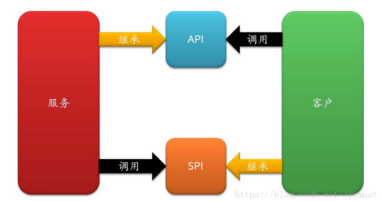

## 综述
首先我们应该思考一个web框架有哪些大部分组成，网页web的功能就是把持久化的数据提供为http服务  
之后随着深入理解，我会不断更新这个东西，有可能会独立出一篇文章来
Cookie Session Token JWT 区别和原理，普通登录、微服务登录统一认证、单点登录的区别
[Cookie Session Token JWT的区别和实现原理(2) - JustJavaIt - 博客园](https://www.cnblogs.com/liaowenhui/p/15390254.html)<br/>
[普通登录、微服务登录、单点登录的区别_哔哩哔哩_bilibili](https://www.bilibili.com/video/BV1f3411G7xk)
session 
### API和SPI
- [API设计指南](https://one-programmer.github.io/docs/http-api-design/)
通俗的讲：API 和 SPI 都是相对的概念，他们的差别只在语义上，API 直接被应用开发人员使用，SPI 被框架扩展人员使用  
API （Application Programming Interface）
-   大多数情况下，都是**实现方**来制定接口并完成对接口的不同实现，**调用方**仅仅依赖却无权选择不同实现。
SPI (Service Provider Interface)
-   而如果是**调用方**来制定接口，**实现方**来针对接口来实现不同的实现。**调用方**来选择自己需要的实现方。

需要注意的事项 
SPI 和 API 也不一定是接口，我这里都是指狭义的具体的接口。

## fastapi中async
是否使用async[^1]  
使用async和不使用async  
```python
from fastapi import FastAPI
import time
import asyncio
import os

app = FastAPI()

@app.get("/async_slowest")
async def async_slowest():
   time.sleep(1)
   return {"message": "async mode but use sync sleep"}
  
@app.get("/async_sleep_in_thread")
async def async_sleep_in_thread():
   loop = asyncio.get_event_loop()
   await loop.run_in_executor(None, time.sleep, 1)
   return {"message": "sleep run in thread pool"}
  
@app.get("/async_sleep")
async def async_sleep():
   await asyncio.sleep(1)
   return {"message": "async mode sleep"}

@app.get("/sync")
def sync_sleep():
   time.sleep(1)
   return {"message": "sync, but run in thread pool"}

```

分别执行100次

| 模式                      | 原理                  | 时间   |
|:------------------------|:--------------------|:-----|
| 异步函数同步方法                | 会被扔到eventloop同步执行   | 100s |
| 异步函数线程执行run_in_executor | 扔到线程池里执行开100个线程     |   1s |
| 异步函数异步方法                | 就是纯纯异步              |   1s |
| 同步函数同步方法                | 自动线程池执行,线程池的默认核心数*5 |   3s |


官方文档的细节[^2] #todo 看完
**FastAPI会对路径操作函数(path operation function)和依赖(dependencies)进行特殊处理**。这个特殊处理是：如果你把函数定义为def而不是async def，那么FastAPI会把它放到单独的线程池中，异步执行，这就是FastAPI精彩的地方。就像官方所说，如果你不清楚你函数里面的调用是不是异步(能不能用await)，那么就把它定义为普通函数，FastAPI会采用多线程的方式处理。乱用async，在async里面有同步调用，则会变成串行，Fast秒变Slow。  
而对于其他函数，FastAPI则不会管，def就是同步调用，立马返回结果。  
现在回过头来看前面的那句话：但是无论你是否使用async，FastAPI都将异步工作，以达到"Fast"的运行速度。  

## pydantic
pydantic比dataclass以及其他方法都慢得多，无论是在创建还是在修改的时候，pydantic因为在runtime会进行解析，创建需要5400ns，但例如tuple只需要30ns，慢了一百八十倍。dataclass需要250ns，慢了21倍。  
但是好用啊！
### 序列化
pydantic的基本使用就不说了，继承Base剩下的就是定义字段名字。  
字段的名字就是序列化字典和json的名字 ，Field中可以使用alias参数  
在使用alias之后，parse的时候读取的就是alias字段。  
序列化的时候json和dict，指定by_alias键就是alias，否则就是定义的字段名字。  

::: details Click to see more

```python
from pydantic import BaseModel, Field  
class R(BaseModel):  
    code: int = Field(alias="Code")  
    message: str = Field(alias="Mess")  
    data: str = Field(alias="Data")  
    commited: int = 1  
  
r = R.parse_obj({"Code": 1, "Mess": "abc", "Data": "abc", "commited": 2})  
y=r.dict(by_alias=True)  
x = r.json()  
print(x,y)
```
运行结果
```
{"code": 1, "message": "abc", "data": "abc", "commited": 2} {'Code': 1, 'Mess': 'abc', 'Data': 'abc', 'commited': 2}
```
:::


常用的还有自定义json序列化器，可以按照类型序列化，也可以拦截自定义处理  
`extra = Extra.allow ` 允许创建完model后还可以添加属性  
使用json序列化器的时候，使用encoders只会去序列化非内置字段，builtin的类型会直接去序列化。  
对于所有的类型都序列化的话，有两种方法
- 使用json_dumps 参数，会把所有的字段传进去，它会比指定的encoder早返回的是json编码的解码？，encoder会失效,  
- @validator这种方法还没实验
::: details Click to see more


```python
# -*-coding:utf-8-*-  
# SettingCode here  
__author__ = "a_little_rubbish"  
__date__ = "2023/1/9 21:49"  
  
# import your model here  
from datetime import datetime  
  
import orjson  
from pydantic import BaseModel, Field, Extra  
  
from utils.schema import convert_date  
  
def convert_datetime(dt) -> str:  # 拦截器
    print(dt.strftime('%Y-%m-%d %H:%M:%S'))  
    return dt.strftime('%Y-%m-%d %H:%M:%S')  

def ascii_to_uft8(v, *, default):  
    for key, value in v.items():  
        if isinstance(value, str):  
            print("str hook")  
            v[key] = value.encode('utf-8')  
    return orjson.dumps(v, default=default).decode()  # 注意返回什么
  
class TemplateBaseModel(BaseModel):  
    class Config:  
        extra = Extra.allow  # 允许创建完model后还可以添加属性
        arbitrary_types_allowed = True  # 允许自定义类型
        json_dumps = ascii_to_uft8  # 指定json序列化器，可以做钩子
        orm_mode = True  
        json_encoders = {  # 对特定类型的json编码器
            # custom output conversion for datetime  
            datetime : convert_datetime  
        }  
  
class R(TemplateBaseModel):  
    code: int = Field(alias="Code")  
    message: str = Field(alias="Mess")  
    data: str = Field(alias="Data")  
    commited: int = 1  
  
r = R.parse_obj({"Code": 1, "Mess": "abc", "Data": "abc", "commited": 2})  
y=r.dict(by_alias=True)  # 使用alias
x = r.json()  
print(x,y)
```
运行结果
```
str hook
str hook
{"code":1,"message":"abc","data":"abc","commited":2} {'Code': 1, 'Mess': 'abc', 'Data': 'abc', 'commited': 2}
```
:::

[^1]: [FastAPI到底用不用async？_程序的战歌的博客-CSDN博客_fastapi async](https://blog.csdn.net/qq_29518275/article/details/109360617)<br/>
[^2]: [Concurrency and async / await - FastAPI](https://fastapi.tiangolo.com/async/)