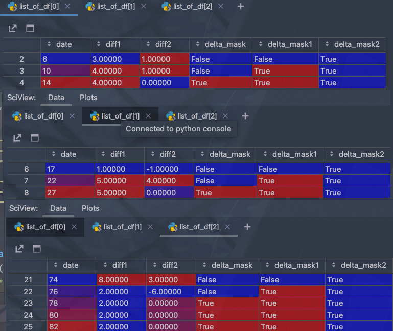

<!-- more -->
<div align="center" style="font-size:1.4em;"><h2><strong> part2-pandas</strong></h2></div>


## 使用pandas发现周期行为
### 需求
现有一堆发包记录，从其中发现周期发包的行为  
需求是很主流的需求，ssh经常是每隔30秒15秒周期发包的  
日志格式也很规律  

| time                | src_aaddr | dest       | other |
|:--------------------|:------------------------------------------------------------------------------------------------------------------------------------------|:-----------|:------|
| 2022-01-22 20:51:05 |                                                                                                                               192.168.0.5 | 172.16.0.1 | ...   |
| 2022-01-26 20:51:10 |                                                                                                                               192.168.0.5 | 172.16.0.1 | ...   |
| 2022-01-26 20:51:15 |                                                                                                                               192.168.0.5 | 172.16.0.1 | ...   |

像这样同源的每次都是隔五秒的就是可能存在的周期发包行为  
日志量可大可小  
### 解决过程
**先观察数据特征**，要求发现周期行为首先确定，发送主体是由 source: 源ip+目的ip+目的端口 唯一确定的，再就是时间，这四个列比较重要   
**对数据进行预处理**，使用pd读取csv，如果文件很大就按字节读取，慢慢分割，攒够多少行了进行处理，把行中不规律的数据补齐，取个样打印一些看看有没有异常值，dtype转换比如时间数字等，会提高读取速度  
**进行分类**，读取之后按照不同主体进行分类，分割出每个主体的df，此时我们拥有了每个source的发包记录，按照发包时间排列。

确定对哪个维度建模，一开始想的是，时间为横轴ip纵轴，这样就可以统计一串bit，利用这个建立坐标系，使用回文检测类似的发现其中的周期  
后来发现时间不是一个好维度，随着时间增长，数据冗余会非常高，而且算法也很难找  

后来看应该是维度找的不对，周期发包，那么肯定时间间隔就相同，时间间隔的计算就是使用shift diff，让本次发包的时间戳减去上一次，就得到了一个时间间隔  
此时如果做坐标系，就是找出所有时间间隔相同，即线为直线的片段  
但是此时继续把时间间隔相位想减，得到时间间隔的差，这时，只要这个差为0那么就说明有两个时间间隔相同，也就是有三个包发包间隔相同  

此时得到的是为0的记录再往上两个记录都是属于间隔发包的，往上两位都置为0  
可以利用上面的思路，先把这一列bool化，shift(-1),再和前一列做或操作，重复一次就实现效果了

写个小demo测试一下
```python
from functools import reduce  

import numpy as np  
import pandas as pd  
  
a = [1, 2, 3, 4, 4, 2, 1, 5, 5, 6, 7, 8, 0, 0, 0, 0, 0, 0, 7, 6, 5, 8, 2, 2, 2, 2, 1]  # 假设这是时间间隔
b = []    
for i in range(1, len(a)):   # 生成测试发包序列
    b.append(reduce(lambda x, y: x + y, a[:i]))  
del a[-1]  
  
print(a)  
  
print(b)  
  
s = {"date": b, "diff1": a}  
df = pd.DataFrame(s)  
  
df["diff1"]=df["diff1"].replace(0,np.nan)  
df["diff2"]=df["diff1"].diff()  
df["delta_mask"]= (df["diff2"] == 0)

df["delta_mask1"]=df["delta_mask"].shift(-1).fillna(False) | df["delta_mask"]  
df["delta_mask2"]=df["delta_mask1"].shift(-1).fillna(False) | df["delta_mask1"]  # 把为0的上三行都变为True  
df1=df[df["delta_mask2"] == True]  
# 在分界处分开
list_of_df = np.split(df1.copy(), np.flatnonzero(np.diff(df.index) != 1) + 1)
```




中间一些细致的需求，比如转nan处理边界啥的，一个地方一个样，就不写了帮不上啥，主要还是理解思路，操作照着handbook和文档都好说  